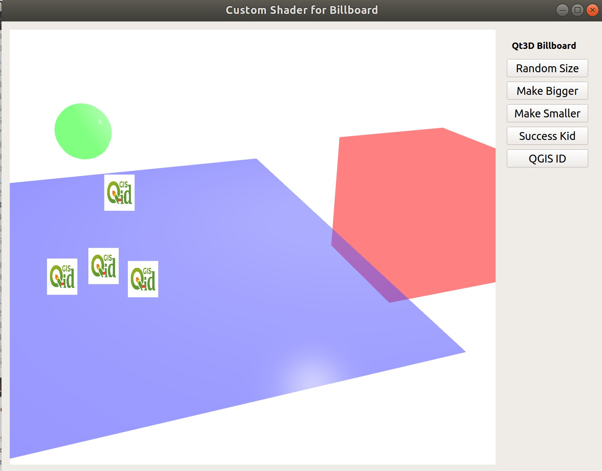

# qt3d-custom-shader
Learning Qt3D with Custom Shader.

## Billboards
It's mainly porting billboard from QML billboard rendering from https://github.com/wonder-sk/qt3d-experiments/tree/master/billboards. Please check the screenshot and gif below to how it will be.

